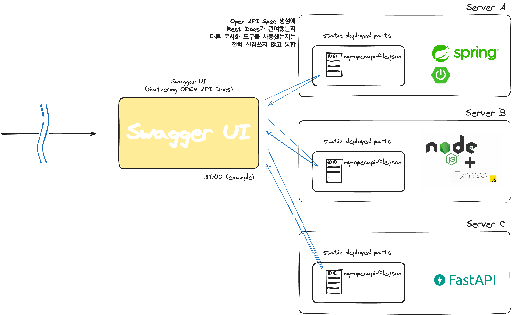

# Demo RestDoc to Swagger UI Integrator

Simple Example.

# 준비: Docker Compose

- <a href="https://www.docker.com/products/docker-desktop/" target="_blank">도커 데스크톱 설치</a>
- 도커 컴포즈 실행. 8000 포트가 비어 있어야 함(8000:8080).
  - 각 서비스 루트에서 실행(`docker-compose.yml` 파일이 있는 곳).

```shell
docker-compose up -d --build
```

## 전제 조건

- Syntax Level: Java 17

# 전체 구성도 예시

